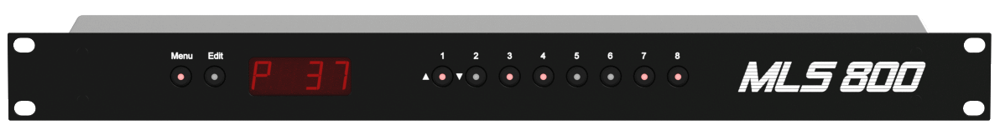
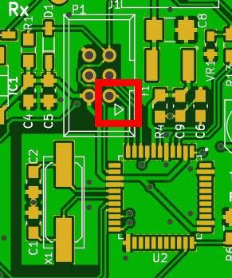
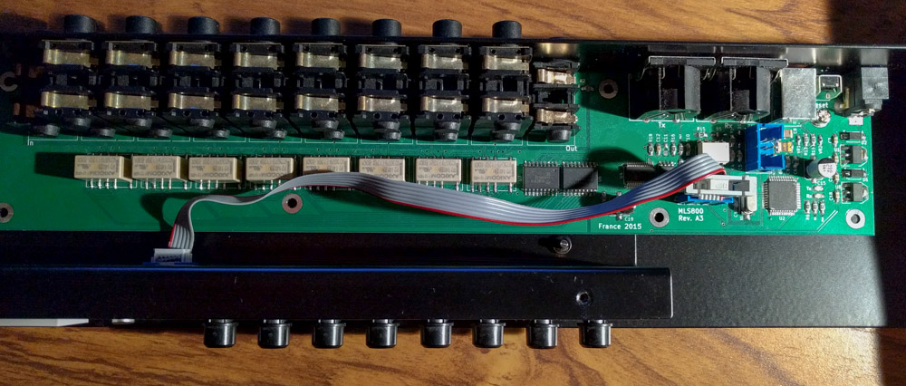
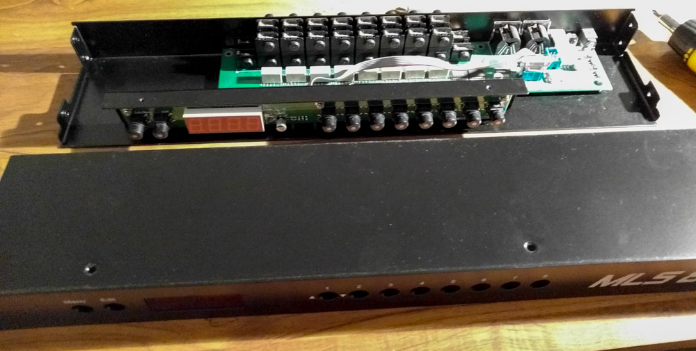
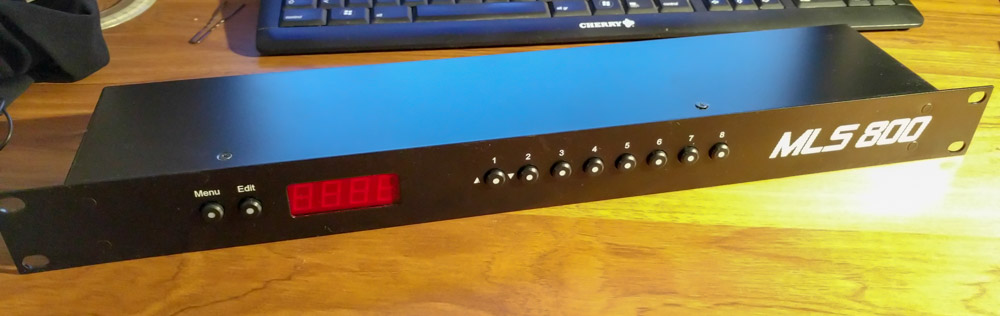
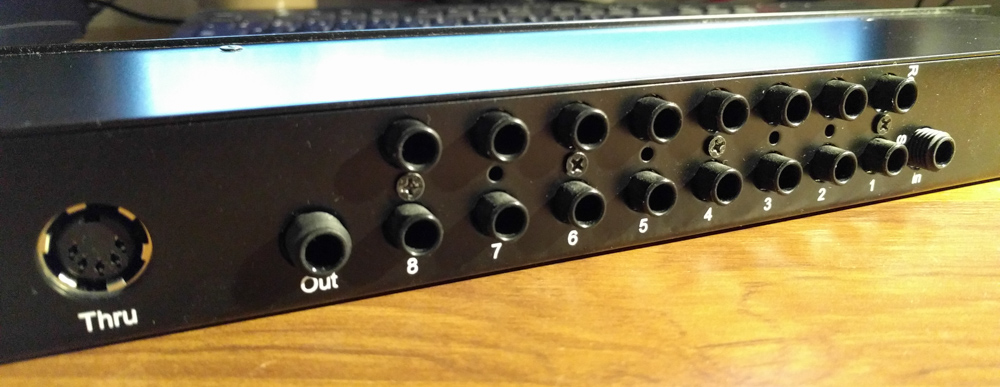

# Building instructions

  

--8<-- "_partials/repositories.md"

While the PCB and firmware are mandatory, you can totally omit to build the enclosure, which is the most expensive part of the build.

## Important considerations

--8<-- "_partials/disclaimer.md"

!!! warning "Before you really consider this..."
    I've built this rack several years ago, and have been using it since then. However, I do not have physical access to the rack at the moment. I used some time off to publish this work, and in order to do so, I had to change some parts of the code. The 4 years old one I'm using didn't build anymore. I'm ==unable to test== these changes at the moment, so please reach to me first if you really considering building the rack!

## Ordering the PCB

Download the [latest release](https://github.com/blemasle/mls800-pcb/releases/latest). You'll find inside the Gerber files that can be used by the manufacturer of your choice. Just be aware that the PCB is uncommonly large (around 30cm) and that some manufacturers might refuse it. [Seeed](https://www.seeedstudio.com/fusion_pcb.html) and [OSHPark](https://oshpark.com) are good choices. I personally used Seeed because I needed several iterations before settling on a layout and OSHPark was too expensive for that.

As of right now (January 2019), OSHPark charge around 183$ for 3 top notch, gold plated PCBs, while Seeed charge around 50$ for 5. I also still have some leftovers from the last batch :wink:  

## Soldering the PCB

If you know how to solder SMD components, the PCB presents no difficulties whatsoever. If you don't, check out this excellent [Dave's EEVBlog tutorial](https://www.youtube.com/watch?v=b9FC9fAlfQE).  

There are a lot of identical components in those two PCBs so it can feel a bit tedious after some time. Also, don't be greedy on the tin on the back connectors as solder joints are responsible for keeping your connector in place while inserting or removing plugs. If you decide to build the enclosure some of that pressure will be relieved through back screws but this is just an *extra* layer of strengthening, you should not rely on it.

## Flashing the firmware on a blank board

After soldering the PCB, you'll need to flash the necessary bits to its processor to bring it to life. To do so, burn the Arduino micro bootloader through the standard ICSP port `P1`, the &#x25b6; indicating the pin `1`.

&nbsp;

You'll need either a programmer or another Arduino with the `ArduinoISP` sketch loaded on to it. I usually dedicate an Arduino Nano to this task. A complete procedure can be found on the [Arduino website](https://www.arduino.cc/en/Tutorial/ArduinoISP).

* Upload the `ArduinoISP` sketch to a second Arduino
* Carefully wire your programmer to the MLS800 PCB
* From the Arduino IDE, select the `Arduino micro` board and `Arduino as ISP` programmer
* Select the COM port of your programmer
* Hit `Burn Bootloader` command

Once done, the `Edit` LED should blink.

Next, follow [Flashing the firmware](manual.md#firmware-update) instructions.

## Ordering the case and display bezel

All the files required to order the enclosure can be downloaded over the [github repository](https://github.com/blemasle/mls800-enclosure/relases/latest). As [I said](hardware.md#the-enclosure) earlier, I choose [Protocase](https://www.protocase.com) - which I again highly recommend - to produce the case parts. The front panel bezel has been ordered from [Bay Plastics Ltd](http://bayplastics.co.uk), but I guess Protocase would be able to make it.  

All required information are included in the release files. Nevertheless, and because the only way to release files with Solidworks seems to create a flat directory structure, here is you need a sum up :  

Part			 | Description						| Thickness 		| Material / Technic| Color 		| Manufacturer 							| 
-----------------|---------------------------------:|------------------:|------------------:|--------------:|--------------------------------------:|
Rack-Chassis	 | Rack case bottom					| 0.048"			| Cold rolled steel | Matte Black	| [Protocase](https://www.protocase.com)
Rack-Cover		 | Rack case top					| 0.048"			| Cold rolled steel | Matte Black	| [Protocase](https://www.protocase.com)
Rack-FrontPanel  | Rack case front					| 0.060"			| Cold rolled steel | Matte Black	| [Protocase](https://www.protocase.com)
MountingBracket	 | Daughterboard mounting bracket	| 0.048"			| Cold rolled steel | Matte Black	| [Protocase](https://www.protocase.com)
mls800 REV 3 - GRAPHICS - v2.svg	| Front and Back illustrations		| :x:				| Digital printing	| White			| [Protocase](https://www.protocase.com)
FrontPanel-Bezel | Main display bezel				| 0.118"/3mm		| Acrylic(Perspex)	| 4401 Red		| [Bay Plastics Ltd](http://bayplastics.co.uk)

## Assembly

!!! warning
	While I knew nothing about tolerances at the time and did not take those into account during my designs, I only had to remove one screw and not fully tighten another for the case to be perfectly aligned. Both problematic screws where on the front panel "S" mounting bracket, which I knew would be a very tight fit without using tolerances.

Now that you have all the pieces at hand, let's play some Lego(r) :smile:!  
First, screw the motherboard to the Rack chassis, then the daughterboard to the mounting bracket. Do not forget to add rear screws to the stacked jack headers to relieve the pressure on the solder joints while inserting or removing jacks.

  

!!! note
	Please note that I decided to remove the bottom middle screw of the daughter board to avoid inducing tension to the PCB.

You can now place the mounting bracket on to the rack chassis, and connect the ribbon cable between the two PCBs.  
Then, snap the bezel into the front panel. This should be a precise fit and should not require any rework and/or glue to make it stick. Screw the front panel and the cover together.

  

Finally, screw together the two subassemblies. You're done!

!!! note
	On my unit, the top right screw of the mounting bracket is not fully tightened. When it is, some of the switches do not properly work. It comes from the fact that the rack was designed without any tolerances consideration.  
	Knowing that, I consider it a miracle that I only have 2 minor flaws on the final product. That underlines once more Protocase's wonderful work. 

  

