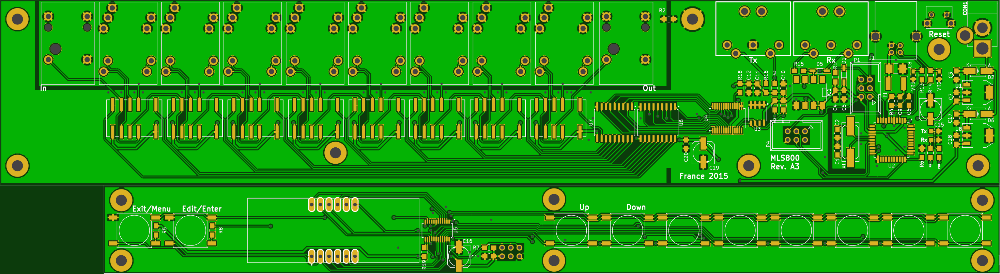
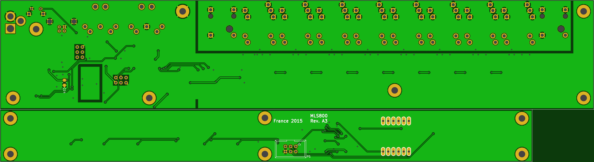

# Building instructions

!!! warning "Before you really consider this..."
    I've built this rack several years ago, and have been using it since then. However, I do not have physical access to the rack at the moment. I used some time off to publish this work, and in order to do so, I had to change some parts of the code. The 4 years old one I'm using didn't build anymore. I'm ==unable to test== these changes at the moment, so please reach to me first if you really considering building the rack!

The project is built around three repositories :

 * @blemasle/mls800-pcb : Motherboard and daughterboard PCBs
 * @blemasle/mls800-firmware : Firmware that needs to be loaded on to the motherboard
 * @blemasle/mls800-case : CAD files needed to produce the case

 While the PCB and firmware parts are mandatory, you can totally omit to the case, which moreover is the most expensive part of the build.

## Ordering the PCB

Download the [latest release](https://github.com/blemasle/mls800-pcb/releases/latest). Inside, you'll find the Gerber files that can be used by the manufacturer of your choice. Just be aware that the PCB is uncommonly large (around 30cm) and that some manufacturers might refuse it. [Seeed](https://www.seeedstudio.com/fusion_pcb.html) and [OSHPark](https://oshpark.com) are good choices. I personally used Seeed because I needed several iterations before settling on a layout and OSHPark was too expensive for that.

As of right now (January 2019), OSHPark charge around 183$ for 3 top notch, gold plated PCBs, while Seeed charge around 50$ for 5. I also still have some leftovers from the last batch :wink:  

## Soldering the PCB

If you know how to solder SMD components, the PCB presents no difficulties whatsoever. If you don't, check out the excellent [Dave's EEVBlog tutorial](https://www.youtube.com/watch?v=b9FC9fAlfQE).  

There are a lot of identical components in those two PCBs so it can feel a bit boring after some time. Also, don't be greedy on the tin on the back connectors as solder joints are responsible for keeping your connector in place while inserting or removing plugs. While if you're building the case, some of that pressure will be relieved through back screws, this is just an *extra* layer of strengthening, you should not rely on it.

## Ordering the case and display bezel

All the files required to order the case can be downloaded over the [github repository](https://github.com/blemasle/mls800-case/relases/latest). As [I said](hardware#the-case) earlier, I ordered the case from [Protocase](https://www.protocase.com) which I again highly recommend. The front panel bezel has been ordered from [Bay Plastics Ltd](http://bayplastics.co.uk), but I'm guessing that Protocase would be able to make it.  

Required information is included in the release files, but just in case, here is a sum up, along with the manufacturer I used. 

Part			 | Description						| Thickness 		| Material / Technic| Color 		| Manufacturer 							| 
-----------------|---------------------------------:|------------------:|------------------:|--------------:|--------------------------------------:|
Rack-Chassis	 | Rack case bottom					| 0.048"			| Cold rolled steel | Matte Black	| [Protocase](https://www.protocase.com)
Rack-Cover		 | Rack case top					| 0.048"			| Cold rolled steel | Matte Black	| [Protocase](https://www.protocase.com)
Rack-FrontPanel  | Rack case front					| 0.060"			| Cold rolled steel | Matte Black	| [Protocase](https://www.protocase.com)
MountingBracket	 | Daughterboard mounting bracket	| 0.048"			| Cold rolled steel | Matte Black	| [Protocase](https://www.protocase.com)
MLS800.svg		 | Front and Back illustrations		| :x:				| Digital printing	| White			| [Protocase](https://www.protocase.com)
FrontPanel-Bezel | Main display bezel				| 0.118"/3mm		| Acrylic(Perspex)	| 4401 Red		| [Bay Plastics Ltd](http://bayplastics.co.uk)

