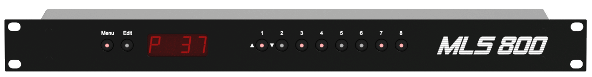

hero: An open-source MIDI controlled loop switcher

!!! note
	The project is long done, but publishing it is a work in progress. Some links in this documentation might be dead.

# MLS800

The MLS800 is an open-source 1U rack unit MIDI controlled Loop Switcher with 8 audio loops.  

## Features

--8<-- "_partials/features.md"

  

!!! warning "Disclaimer"  
    This project was merely a study case. At the time, I knew almost nothing and had to learn everything. As a consequence, and while (even if?) I did my best to built a "professional" product, the finished product might have some flaws.

## Sources

--8<-- "_partials/repositories.md"
