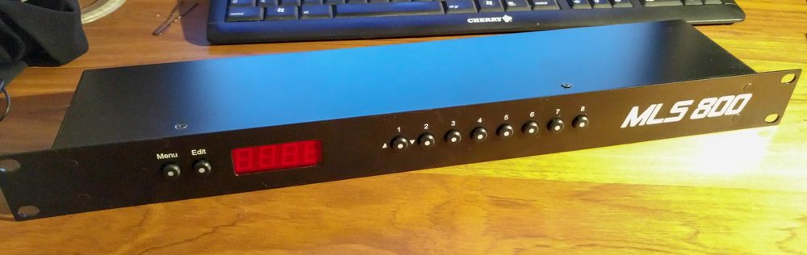

hero: An open-source MIDI controlled loop switcher

# MLS800

The MLS800 is an open-source 1U rack unit MIDI Loop Switcher with 8 audio loops.  

## Features

* 8 audio loops
* 128 presets
* Active preset is controlled by `Program Change` MIDI message
* Immediate feedback of activated loops through 8 illuminated switches
* 4 digits 7 segment display
* Carefully designed PCB to minimize induced noise

!!! warning "Disclaimer"  
	This project was merely a study case. At the time, I knew almost nothing and had to learn everything. As a consequence, and while I did my best to built a "profesionnal" product, the finished product might have some flaws.
